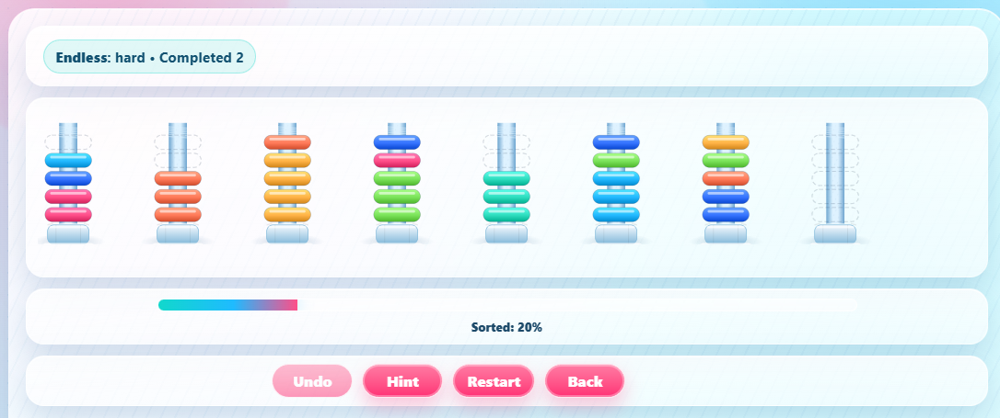
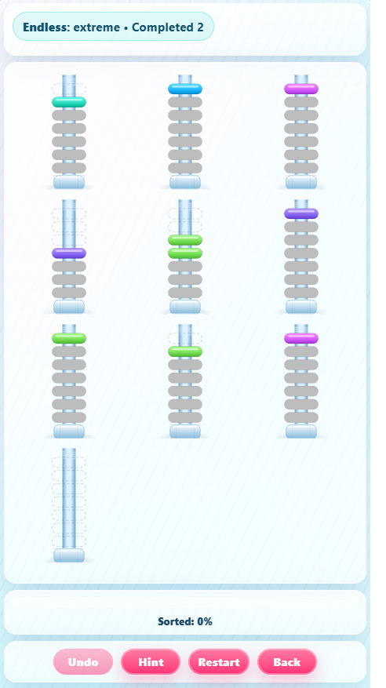

# Nuts and Bolts game

A casual puzzle game where the player groups same-colored "nuts" onto "bolts".

Live demo

The application is deployed to GitHub Pages at: <https://RangerChris.github.io/NutsAndBolts/>
Visit that URL to test the app (the site updates automatically on push or when the deploy workflow runs).





## Development

Install dependencies and start dev server:

```
npm install
npm run dev
```

Run tests (Vitest):

```
npm run test
```

## Project overview

Nuts and Bolts is a single-screen puzzle: move contiguous top groups of same-colored nuts between bolts to produce bolts containing only a single color. The app includes a seeded level generator (reproducible by seed) and an undo history.

Controls

- Click / tap a bolt to pick its top contiguous group.
- Click / tap a target bolt to attempt the move (legal if empty or matching top color and target capacity allows).
- Use the bottom action bar for `Undo` actions.

Quick commands

Install, start dev server, run tests, and build:

```bash
npm install
npm run dev     # start dev server (Vite)
npm run build   # production build
npm run test    # run unit & integration tests (Vitest)
npm run test:e2e  # run Playwright e2e tests
```
